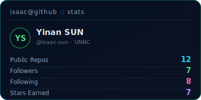
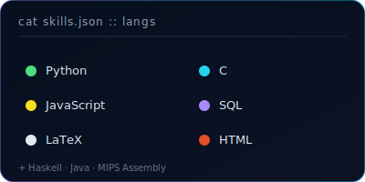
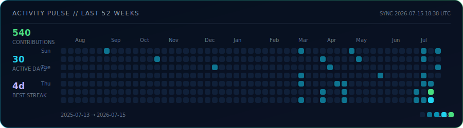

<div align="center">
  
</div>

<div align="center">
  <sub><b>Computer Science + AI @ UNNC</b> &nbsp;•&nbsp; Federated Learning &nbsp;•&nbsp; AI Systems &nbsp;•&nbsp; Open Source</sub>
</div>

<br />

<div align="center">
  <a href="mailto:scyys25@nottingham.edu.cn"></a>
  <a href="https://www.linkedin.com/in/isaac-sun/"></a>
  <a href="https://isaac-sun.github.io"></a>
</div>

<br />

<div align="center">
  
  
  
</div>

<br />

## `cat profile.toml`

```toml
name       = "Yinan SUN (isaac)"
location   = "Ningbo, China"
education  = "Computer Science + Artificial Intelligence, UNNC"
focus      = ["Federated Learning", "AI Systems", "ML from scratch"]
currently  = "Open to research collaboration and internships"
```

I study how learning systems can stay useful when data and compute are distributed. I enjoy turning papers into reproducible experiments, then carrying the same care into developer-facing tools.


## `signal --live`

<p><sub>These cards query GitHub’s API and are regenerated by GitHub Actions every day at <b>02:13 CST</b>. They are live data, not screenshots.</sub></p>

<div align="center">
  
  
</div>

<br />

<div align="center">
  
</div>


## `ls projects/`

| Project | Focus | Built with |
| --- | --- | --- |
| **[Chest X-ray FL](https://github.com/isaac-sun/Chest-X-ray-Pneumonia-Classification-with-Centralized---Federated-Learning)** | A rigorous centralized-vs-FedAvg study for pneumonia classification: non-IID clients, Grad-CAM, and evaluation tooling. | `Python` · `PyTorch` |
| **[FedFree](https://github.com/isaac-sun/fedfree)** | A free-rider defense using two-phase, per-class Shapley values with DistilBERT + LoRA/PEFT. | `Python` · `PyTorch` · `PEFT` |
| **[CS & AI Notes](https://github.com/isaac-sun/cs-ai-learning-notes)** | A living set of notes on mathematical foundations, algorithms, and machine learning built from first principles. | `LaTeX` · `Notes` |
| **[isaac-sun.github.io](https://github.com/isaac-sun/isaac-sun.github.io)** | Personal website and blog, deployed with GitHub Pages. | `HTML` |


## `stack --current`

<div align="center">
  
  
  
  
  
  
  
  
  
</div>

<br />

## `contrib --animate`

<div align="center">
  <picture>
    <source media="(prefers-color-scheme: dark)" srcset="https://raw.githubusercontent.com/isaac-sun/isaac-sun/output/github-contribution-grid-snake-dark.svg" />
    <source media="(prefers-color-scheme: light)" srcset="https://raw.githubusercontent.com/isaac-sun/isaac-sun/output/github-contribution-grid-snake.svg" />
    
  </picture>
</div>

<br />

<div align="center">
  
</div>
