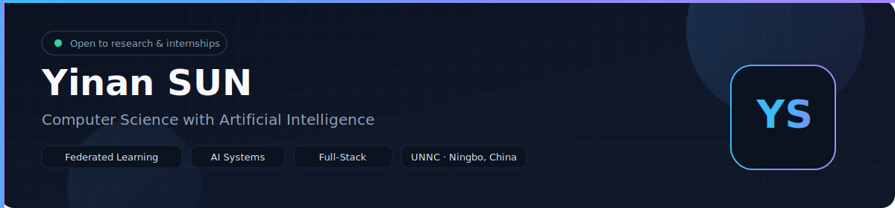
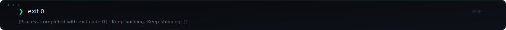

<p align="center">
  
</p>

<p align="center">
  <a href="https://readme-typing-svg.demolab.com?font=Fira+Code&weight=500&size=18&duration=3000&pause=1500&color=4ADE80&center=true&vCenter=true&width=750&lines=%24+whoami+--verbose;Federated+Learning+Researcher;Full-Stack+Engineer+%2F+Product+Builder;AI+Systems+%7C+Model+Optimization;Always+be+shipping.">
    
  </a>
</p>

<p align="center">
  <a href="mailto:scyys25@nottingham.edu.cn"></a>
  <a href="https://www.linkedin.com/in/isaac-sun/"></a>
  <a href="https://github.com/isaac-sun"></a>
</p>

<p align="center">
  
  
</p>

---

## `$ cat /etc/profile`

```text
  isaac@github
  ────────────────────────────────────────────────────
  os          CS with Artificial Intelligence
  university  University of Nottingham Ningbo China
  languages   Python · C · JavaScript · SQL · LaTeX
  location    Ningbo, China
  focus       Federated Learning · AI Systems · Full-Stack Dev
  status      [OPEN] Internship & research collaboration
```

## `$ cat skills.json`

**Languages**


**Frameworks**


**Tools**


## `$ ls -la projects/`

```
UNDER CONSTRUCTION
```

> `tip:` Link each directory name to its actual repository and add a one-line value proposition.

## `$ uptime && git streak`

<p align="center">
  
</p>

<p align="center">
  
</p>

## `$ cat roadmap.txt`

```
# 2026 Goals
# ──────────────────────────────────────────────────────────────────
  Q1  →  publish end-to-end federated learning project with docs
  Q2  →  make a meaningful contribution to open-source AI tooling
  Q3  →  ship a production-ready full-stack side project
  Q4  →  publish technical notes on systems design and ML
```

## `$ cat /proc/interests`

```
photography     visual storytelling and composition
debate          structured argument and first-principles thinking
languages       cross-cultural communication
```

## `$ fortune`

```
"Talk is cheap. Show me the code."  —  Linus Torvalds
```

<p align="center">
  
</p>
